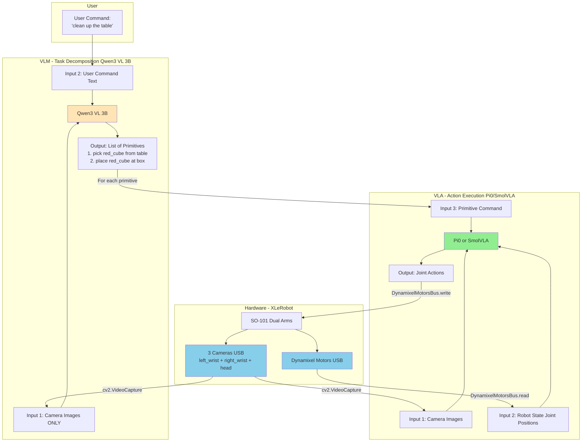
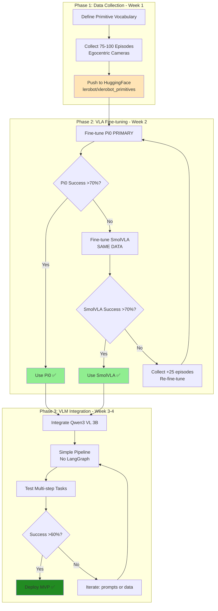

# VLM→VLA Fine-tuning Strategy for XLeRobot
**Project Goal**: Enable VLM to decompose complex user requests into sequences of simple task commands, which VLA executes step-by-step on XLeRobot SO-101 dual-arm system with egocentric cameras.

**Date**: 2025-11-15 (Updated with Qwen3 VL & LangGraph analysis)
**Status**: Research Complete, Ready for Implementation

---

## Table of Contents
1. [Executive Summary](#executive-summary)
2. [Critical Issue: Camera Domain Mismatch](#critical-issue-camera-domain-mismatch)
3. [VLA Model Selection](#vla-model-selection)
4. [VLM Model Selection](#vlm-model-selection)
5. [VLM→VLA System Architecture](#vlmvla-system-architecture)
6. [Orchestration: Simple Pipeline vs LangGraph](#orchestration-simple-pipeline-vs-langgraph)
7. [Strategic Recommendation](#strategic-recommendation)
8. [Fine-tuning Execution Plan](#fine-tuning-execution-plan)
9. [Best Practices](#best-practices)
10. [Risk Mitigation](#risk-mitigation)
11. [Timeline & Resources](#timeline--resources)
12. [Appendix: Configuration Templates](#appendix-configuration-templates)

---

## Executive Summary

### Current Situation
- **Hardware**: XLeRobot dual-arm SO-101 with **egocentric cameras** (left_wrist + right_wrist + head)
- **Goal**: VLM decomposes complex tasks → VLA executes primitive actions
- **GPU**: RTX 5090 24GB VRAM ✅
- **Critical Challenge**: Camera viewpoint mismatch between pretrained VLA models and XLeRobot setup

### Key Research Findings

**VLA Models (Action Execution):**
1. **Pi0** (`lerobot/pi0_base`) - 4B params, trained on 10,000+ hours diverse data → **PRIMARY CHOICE**
2. **SmolVLA** (`lerobot/smolvla_base`) - 450M params, trained on 50 SO-101 episodes → **BACKUP**

**VLM Models (Task Decomposition):**
1. **Qwen3 VL 3B** (`Qwen/Qwen2-VL-3B-Instruct`) - Open-source, local inference → **RECOMMENDED**
2. **GPT-4V / Gemini / Claude** - API-based, stronger reasoning → **Alternative**

**Orchestration:**
- **Simple Python script** - Sufficient for MVP (Week 1-4)
- **LangGraph** - Optional for advanced features (Week 5+)

### Critical Discovery: Camera Domain Mismatch

| Aspect | Pretrained VLA Models | XLeRobot Setup |
|--------|---------------------|----------------|
| **Camera position** | External fixed stands | Mounted on robot arms |
| **Viewpoint** | Static third-person | Egocentric first-person |
| **Movement** | Cameras stationary | Cameras move with arms |
| **Impact** | Model trained on this | Must adapt vision encoder |

**Key Insight**: Pi0's diverse camera training (10,000+ hours) handles egocentric cameras better than SmolVLA's narrow external-only training (50 episodes).

### Strategic Recommendation

**Week 1**: Collect 75-100 episodes of primitive actions (reusable dataset)

**Week 2**: Fine-tune **Pi0 first** (50-100 episodes sufficient)
- If Pi0 ≥70% success → Use Pi0 ✅
- If Pi0 <70% → Try SmolVLA on **same data** (100-150 episodes needed)

**Week 3-4**: Integrate **Qwen3 VL 3B** for task decomposition
- Simple Python orchestration script (no LangGraph initially)
- VLM→VLA pipeline with primitive vocabulary constraints

**Week 5+**: Iterate and optionally add LangGraph for advanced features

**Expected Outcome**: 60-80% success on multi-step natural language tasks in 3-4 weeks

---

## Critical Issue: Camera Domain Mismatch

### Understanding the Mismatch

This is THE most important factor affecting VLA model selection and data requirements.

#### Pretrained VLA Models: External Fixed Cameras

**SmolVLA Training Setup** (`lerobot/svla_so101_pickplace`):
```yaml
cameras:
  observation.images.up:     # External overhead camera
    position: Fixed stand in front of workspace
    viewpoint: Static third-person, birds-eye
    movement: STATIONARY (never moves)

  observation.images.side:   # External side camera
    position: Fixed stand beside workspace
    viewpoint: Static third-person, profile
    movement: STATIONARY (never moves)

characteristics:
  - Cameras see ENTIRE workspace always
  - Viewpoint NEVER changes (background stable)
  - Can see both object and gripper simultaneously
  - Training: 50 episodes, 11.9k frames - ALL with this viewpoint
```

**Visual Example (External Fixed):**
```
Frame 1:   [table] [cube] [box] [arm_far_right]
Frame 50:  [table] [cube] [box] [arm_extended]
Frame 100: [table] [cube_held] [box] [arm_at_cube]

→ Camera viewpoint: IDENTICAL across all frames
→ Only arm position changes
```

#### XLeRobot: Egocentric Moving Cameras

**Your Actual Setup:**
```yaml
cameras:
  observation.images.left_wrist:   # On left arm
    position: Mounted near left wrist
    viewpoint: Egocentric first-person (gripper POV)
    movement: MOVES with left arm continuously

  observation.images.right_wrist:  # On right arm
    position: Mounted near right wrist
    viewpoint: Egocentric first-person (gripper POV)
    movement: MOVES with right arm continuously

  observation.images.head:         # Above workspace
    position: Robot head
    viewpoint: Egocentric birds-eye (closer than external)
    movement: MAY MOVE if head actuated

characteristics:
  - Viewpoint CONSTANTLY CHANGES with arm motion
  - Close-up view of gripper/object (different scale)
  - May NOT see target when gripper far away
  - Completely different visual experience
```

**Visual Example (Egocentric):**
```
Frame 1:   [floor] [table_edge_bottom]
Frame 50:  [table_surface] [cube_approaching] [motion_blur]
Frame 100: [CLOSE_UP_CUBE] [gripper_fingers] [no_background]

→ Camera viewpoint: COMPLETELY DIFFERENT every frame
→ Background, scale, objects in view all change
```

### Impact on VLA Model Selection

#### Pi0: Better for Egocentric Cameras ✅

**Why Pi0 handles the mismatch better:**

1. **Diverse Pretraining**:
   - 10,000+ hours across many robot platforms
   - Various camera configurations (not just external fixed)
   - Vision encoder has seen viewpoint variations

2. **Stronger VLM Backbone**:
   - Paligemma (~3B param vision-language model)
   - Better at viewpoint-invariant understanding

3. **Data Efficiency**:
   - Physical Intelligence reports: 20-100 episodes sufficient
   - Vision already robust → only needs to learn SO-101 kinematics

**Expected Performance:**
- 50-75 episodes: 60-70% success (learning kinematics)
- 75-100 episodes: 75-85% success (good generalization)

#### SmolVLA: Requires Heavy Vision Retraining ⚠️

**Why SmolVLA struggles:**

1. **Narrow Pretraining**:
   - Only 50 episodes with single camera config
   - Vision encoder has NEVER seen egocentric viewpoint
   - From our diagnostic: Commanded 130° shoulder_pan (confused by viewpoint)

2. **Two Components**:
   - ✅ Action Expert: Knows SO-101 kinematics (TRANSFERABLE)
   - ❌ Vision Encoder: Trained on external cameras (NEEDS RETRAINING)

**Expected Performance:**
- 50-75 episodes: 40-50% success (vision mismatch dominates)
- 100-150 episodes: 70-80% success (vision retrained)

---

## VLA Model Selection

VLA models execute primitive actions based on camera observations, robot state, and primitive command.

### Pi0 (`lerobot/pi0_base`) - PRIMARY CHOICE

**Architecture:**
- **Parameters**: 4B (3B vision-language + 300M diffusion action expert)
- **Vision Encoder**: Paligemma VLM
- **Action Expert**: Flow-matching diffusion model
- **Input**: Multi-camera RGB + robot state + language instruction
- **Output**: Action chunks (temporal action sequences)

**Pretrained Data:**
- **Scale**: 10,000+ hours of diverse manipulation
- **Tasks**: Bussing dishes, packing, folding, assembly, cooking, etc.
- **Embodiments**: Multiple robot platforms (not SO-101 specific)
- **Cameras**: Various configs including egocentric-like setups ✅
- **Key advantage**: Diverse pretraining → robust vision

**Strengths for XLeRobot:**
- ✅ **Best camera generalization** for egocentric setup
- ✅ **Data-efficient**: 50-100 episodes sufficient
- ✅ **Superior instruction following**: Strong VLM backbone
- ✅ **Diffusion action model**: Handles multimodal distributions

**Weaknesses:**
- ⚠️ No SO-101 kinematics knowledge (must learn)
- ⚠️ Requires LoRA to fit in 24GB
- ⚠️ Slower inference: ~10-15Hz

**Fine-tuning Requirements:**
- **Episodes**: 50-100
- **VRAM**: 18-22GB with LoRA
- **Training time**: 6-10 hours on RTX 5090
- **Hardware**: ✅ RTX 5090 24GB with LoRA

**When to choose**: Egocentric cameras (your case!)

### SmolVLA (`lerobot/smolvla_base`) - BACKUP CHOICE

**Architecture:**
- **Parameters**: 450M
- **Vision Encoder**: Pretrained VLM backbone (smaller than Pi0)
- **Action Expert**: Transformer-based policy
- **Input**: Multi-camera RGB + robot state + language instruction
- **Output**: Joint positions (6 DOF)

**Pretrained Data:**
- **Dataset**: `lerobot/svla_so101_pickplace` (50 episodes)
- **Task**: Pick and place
- **Cameras**: 2 cameras - EXTERNAL FIXED only ❌
- **Robot**: SO-100 follower arm (compatible with SO-101)
- **Key limitation**: Narrow camera viewpoint

**Strengths for XLeRobot:**
- ✅ Knows SO-101 kinematics (action expert pretrained)
- ✅ Smallest model (8-12GB VRAM)
- ✅ Fast inference: 30Hz+ (real-time)

**Weaknesses:**
- ❌ Vision trained on WRONG cameras (external only)
- ❌ Requires vision retraining: 100-150 episodes
- ❌ Weaker instruction following (smaller backbone)

**Fine-tuning Requirements:**
- **Episodes**: 100-150 (vision encoder retraining)
- **VRAM**: 8-12GB
- **Training time**: 6-8 hours on RTX 5090
- **Hardware**: ✅✅ RTX 5090 24GB (plenty of room)

**When to choose**: If Pi0 doesn't fit in VRAM or performance <70%

### Comparison Summary

| Factor | Pi0 | SmolVLA |
|--------|-----|---------|
| **Camera generalization** | ✅ Excellent | ❌ Poor |
| **SO-101 kinematics** | ⚠️ Must learn | ✅ Already knows |
| **Episodes for egocentric** | 50-100 | 100-150 |
| **VRAM (24GB GPU)** | ✅ Fits with LoRA | ✅✅ Plenty |
| **Instruction following** | ✅ Excellent | ⚠️ Good |
| **Inference speed** | 10-15Hz | 30Hz+ |
| **Overall for XLeRobot** | ✅ **80% probability** | ⚠️ **70% probability** |

**Recommendation**: Try Pi0 first, SmolVLA as backup using same collected data.

---

## VLM Model Selection

VLM models decompose high-level user commands into sequences of primitive actions that VLA can execute.

### Qwen3 VL 3B (`Qwen/Qwen2-VL-3B-Instruct`) - RECOMMENDED

**Why Qwen3 VL 3B for XLeRobot:**

**Architecture:**
- **Parameters**: 3B (vision-language model)
- **Input**: Multi-camera RGB images + text instruction
- **Output**: Text (sequence of primitive commands)
- **License**: Open-source (Apache 2.0)

**Strengths:**
- ✅ **Runs locally**: No API costs ($0 vs $50-100)
- ✅ **Fits on RTX 5090**: ~6-8GB VRAM (alongside VLA model)
- ✅ **Vision-language capable**: Can see cameras and understand instructions
- ✅ **Fast inference**: ~3B is efficient for real-time decomposition
- ✅ **Multilingual**: Supports multiple languages

**Weaknesses:**
- ⚠️ **Smaller than GPT-4V**: May have weaker visual reasoning
- ⚠️ **Requires prompt engineering**: Needs examples to constrain output
- ⚠️ **No robot-specific training**: Hasn't seen robot task decomposition

**Does Qwen3 VL Need Fine-tuning?**

**NO (initially)** - Use zero-shot with strong prompting:
- Qwen3 VL already has vision understanding (objects, spatial relations)
- Qwen3 VL already has language understanding (commands, primitives)
- It does NOT need to know robot kinematics (that's VLA's job)

**MAYBE (Week 5+)** - Fine-tune if decomposition quality <70%:
- Collect 50-100 examples of (scene, command, correct_decomposition)
- Fine-tune Qwen3 VL on task decomposition dataset
- Expected improvement: +15-20% decomposition accuracy
- Cost: ~$50, Time: 2-4 hours on RTX 5090

**Expected Performance:**

| Task Complexity | Qwen3 VL 3B | GPT-4V/Gemini |
|----------------|-------------|---------------|
| Object identification | Good (80%+) | Excellent (95%+) |
| Spatial reasoning | Moderate (60-70%) | Excellent (90%+) |
| Task decomposition | Good with prompts (70%+) | Excellent (85%+) |
| Cost | $0 (local) | ~$50-100 (API) |

**Recommendation**: ✅ **Start with Qwen3 VL 3B** (local, free), fall back to GPT-4V if decomposition <70%

### Alternative: GPT-4V / Gemini / Claude

**When to use API-based VLMs:**
- Qwen3 VL decomposition quality <70%
- Need stronger visual reasoning for complex scenes
- Budget allows API costs ($50-100 for testing)

**Pros:**
- ✅ Stronger visual reasoning
- ✅ Better spatial understanding
- ✅ More robust to novel scenarios

**Cons:**
- ❌ API costs (~$0.01-0.05 per decomposition)
- ❌ Latency (network roundtrip)
- ❌ Requires internet connection

---

## VLM→VLA System Architecture

### IMPORTANT: VLM vs VLA Input Clarification

**Common Misconception**: VLM needs robot states

**REALITY**: VLM only needs cameras, VLA needs cameras + robot states



### Input/Output Breakdown

#### VLM (Qwen3 VL) - Task Decomposition Only

```python
# VLM Input
vlm_input = {
    'images': [camera_left, camera_right, camera_head],  # Visual observation
    'user_command': "clean up the table"                  # Text instruction
}
# NO robot states needed!

# VLM Output (pure text)
vlm_output = [
    "pick red_cube from table",
    "place red_cube at box",
    "pick blue_cube from table",
    "place blue_cube at box"
]
```

**Key Point**: VLM only does vision + language reasoning. It doesn't need robot joint positions because it's not predicting actions!

#### VLA (Pi0/SmolVLA) - Action Execution

```python
# VLA Input (for EACH primitive)
vla_input = {
    'images': [camera_left, camera_right, camera_head],  # Visual observation
    'state': [θ1, θ2, θ3, θ4, θ5, θ6, gripper],          # Robot joint positions
    'task': "pick red_cube from table"                    # Primitive from VLM
}

# VLA Output (actions)
vla_output = {
    'joint_positions': [θ1_new, θ2_new, ..., θ6_new],   # Degrees
    'gripper': 0.5                                       # Gripper opening
}
```

**Key Point**: VLA needs robot state to predict next actions based on current pose.

### Hardware Interface

```python
# Camera reading (USB) - Used by BOTH VLM and VLA
import cv2
camera_left = cv2.VideoCapture(0)   # /dev/video0 (left wrist)
camera_right = cv2.VideoCapture(2)  # /dev/video2 (right wrist)
camera_head = cv2.VideoCapture(4)   # /dev/video4 (head)

# Robot state reading (USB via Dynamixel) - Used by VLA ONLY
from lerobot.common.robot_devices.motors.dynamixel import DynamixelMotorsBus
motors = DynamixelMotorsBus(port="/dev/ttyUSB0")
current_positions = motors.read("Present_Position")  # [θ1, θ2, ..., θ6]

# Summary:
# - VLM: Only needs cameras (for visual scene understanding)
# - VLA: Needs cameras + robot states (for action prediction)
```

### Primitive Action Vocabulary

The VLA learns a **vocabulary of executable primitives** that VLM composes into complex tasks.

**Recommended Primitive Set (75-100 episodes total):**

```python
PRIMITIVE_VOCABULARY = {
    # Object Manipulation (45 episodes)
    "pick": {
        "template": "pick <object> from <location>",
        "examples": ["pick red_cube from table", "pick blue_cube from left"],
        "episodes": 15
    },
    "place": {
        "template": "place <object> at <location>",
        "examples": ["place red_cube at box", "place blue_cube at target"],
        "episodes": 15
    },
    "push": {
        "template": "push <object> to <location>",
        "examples": ["push cube to target", "push object forward"],
        "episodes": 10
    },

    # Motion Primitives (25 episodes)
    "reach": {
        "template": "reach <location>",
        "examples": ["reach table_center", "reach above_cube"],
        "episodes": 10
    },
    "hover": {
        "template": "hover_over <location>",
        "examples": ["hover_over red_cube"],
        "episodes": 8
    },

    # Gripper Control (20 episodes)
    "grasp": {
        "template": "grasp <object>",
        "examples": ["grasp red_cube"],
        "episodes": 10
    },
    "release": {
        "template": "release",
        "episodes": 8
    }
}

# Total: ~88 episodes (target 75-100 with variations)
```

---

## Orchestration: Simple Pipeline vs LangGraph

### Do You Need LangGraph for VLM→VLA?

**Short Answer**: NO (not initially), USEFUL (for advanced features later)

### Simple Python Pipeline is Sufficient for MVP

```python
# Simple orchestration (no LangGraph) - RECOMMENDED for Week 1-4
class VLMVLAPipeline:
    def __init__(self, vlm_model, vla_model, cameras, robot):
        self.vlm = vlm_model      # Qwen3 VL 3B
        self.vla = vla_model      # Pi0 or SmolVLA
        self.cameras = cameras
        self.robot = robot

    def execute_task(self, user_command):
        # Step 1: VLM decomposition
        camera_images = self.cameras.read()
        primitives = self.vlm.decompose(user_command, camera_images)

        # Step 2: VLA execution (simple loop)
        for primitive in primitives:
            success = self._execute_primitive(primitive)
            if not success:
                return False  # Abort on failure

        return True

    def _execute_primitive(self, primitive):
        for step in range(100):  # Max 100 steps per primitive
            camera_images = self.cameras.read()
            robot_state = self.robot.read_state()

            # VLA predicts action
            action = self.vla.predict(camera_images, robot_state, primitive)

            # Execute
            self.robot.write_action(action)

            # Check completion
            if self._is_complete(primitive, robot_state):
                return True

        return False  # Timeout
```

**This simple script (150 lines, no LangGraph) provides:**
- ✅ Task decomposition (VLM)
- ✅ Sequential primitive execution (VLA)
- ✅ Basic failure handling (abort on error)

### When LangGraph Becomes Useful

LangGraph adds value for **advanced features** (Week 5+):

#### Use Case 1: Replanning on Failure
```python
# With LangGraph - automatic replanning
if primitive_fails:
    # LangGraph: Replan remaining steps based on current state
    remaining = vlm.replan(
        original_task=user_command,
        completed=primitives[:i],
        failed=primitive,
        current_scene=camera_images
    )
    primitives = remaining  # Update plan dynamically
```

#### Use Case 2: Multi-turn Conversation
```python
# User: "clean the table"
# Robot: "I see 3 cubes. Should I put them all in the box?"
# User: "Only the red ones"
# Robot: "Ok, putting red cubes in box..."

# LangGraph maintains conversation history and context
```

#### Use Case 3: Complex State Management
```python
# LangGraph tracks:
# - Completed vs pending primitives
# - Object locations (updated after each action)
# - Failure history and recovery strategies
# - Environmental changes
```

### Comparison: Simple Script vs LangGraph

| Feature | Simple Python Script | LangGraph |
|---------|---------------------|-----------|
| **Code complexity** | 150 lines | 500+ lines |
| **Learning curve** | 1 day | 1 week |
| **Sequential execution** | ✅ Easy | ✅ Easy |
| **Failure handling** | ⚠️ Basic (abort) | ✅ Advanced (replan) |
| **Replanning** | ❌ Hard to add | ✅ Built-in |
| **Conversation** | ❌ Not supported | ✅ Supported |
| **State tracking** | ⚠️ Manual | ✅ Automatic |
| **For MVP (Week 1-4)** | ✅ **RECOMMENDED** | ⚠️ Overkill |
| **For Production (Week 5+)** | ⚠️ Limited | ✅ Full-featured |

### Recommendation

**Week 1-4 (MVP)**: Simple Python pipeline
- Focus on getting VLM→VLA working end-to-end
- Iterate on VLA fine-tuning and VLM prompting
- Prove the concept works

**Week 5+ (Advanced)**: Add LangGraph if needed
- Only if you need replanning, conversation, or complex state management
- Adds ~500 lines of code + learning curve
- Provides advanced agentic capabilities

**Bottom Line**: Start simple, add complexity only when needed!

---

## Strategic Recommendation

### Phased Multi-Model Approach

**Philosophy**: Collect data once, empirically test multiple models



### Week-by-Week Breakdown

**Week 1: Data Collection**
- Define primitive vocabulary (8-10 primitive types)
- Collect 75-100 episodes using leader-follower teleoperation
- 5Hz action frequency, egocentric camera setup
- Quality control: re-record failed demonstrations

**Week 2: VLA Fine-tuning**
- Fine-tune Pi0 first (50-100 episodes, 6-10 hours training)
- Evaluate on primitives (target: 70%+ success rate)
- If Pi0 <70%, fine-tune SmolVLA on same data (100-150 episodes needed)
- Select better performer

**Week 3-4: VLM→VLA Integration**
- Set up Qwen3 VL 3B (local inference)
- Implement simple Python pipeline (no LangGraph)
- Test with strong prompting and vocabulary constraints
- Iterate on prompts and collect failure examples

**Week 5+ (Optional): Advanced Features**
- Fine-tune Qwen3 VL if decomposition <70%
- Add LangGraph for replanning and conversation
- Expand primitive vocabulary with more data

### Data Reusability: Collect Once, Try Multiple

| Action | Pi0 | SmolVLA | Both |
|--------|-----|---------|------|
| Collect 75-100 episodes | | | ✅ Once |
| Fine-tune model | ✅ First | ⚠️ If Pi0 fails | |
| Training time | 6-10 hours | 6-8 hours | |
| VRAM required | 18-22GB (LoRA) | 8-12GB | |
| Expected success | 75-85% | 70-80% | |
| **Decision** | **Use if ≥70%** | **Use if Pi0 <70%** | **Empirical** |

**Key Advantage**: All VLA models use LeRobot format (100% compatible). Collect once, try both!

---

## Fine-tuning Execution Plan

### Week 1: Data Collection

#### Day 1: Environment Setup

```bash
# 1. Activate LeRobot environment
conda activate lerobot

# 2. Install Qwen3 VL dependencies
pip install transformers>=4.37.0 qwen-vl-utils

# 3. Verify GPU
nvidia-smi
python -c "import torch; print(f'CUDA: {torch.cuda.is_available()}'); print(f'GPU: {torch.cuda.get_device_name(0)}')"

# 4. Test camera access
python -c "import cv2; print([cv2.VideoCapture(i).isOpened() for i in [0,2,4]])"
```

#### Day 2-7: Collect 75-100 Episodes

**Data Collection Script:**

```python
# scripts/collect_xlerobot_primitives.py
from lerobot.scripts.control_robot import record_episode

PRIMITIVES = {
    "pick_left": ("pick red_cube from left_side", 15),
    "pick_center": ("pick red_cube from center", 15),
    "pick_right": ("pick blue_cube from right_side", 15),
    "place_box": ("place red_cube at box", 15),
    "place_left": ("place blue_cube at left_target", 15),
    "push_forward": ("push cube forward", 10),
    "reach_center": ("reach table_center", 10),
    "grasp_cube": ("grasp red_cube", 10),
    "release": ("release object", 8),
}

# Run collection
for primitive_name, (task_desc, num_eps) in PRIMITIVES.items():
    for ep in range(num_eps):
        record_episode(
            robot_config="xlerobot_egocentric",
            dataset_repo_id="lerobot/xlerobot_primitives_egocentric",
            task=task_desc,
            fps=5,  # CRITICAL: 5Hz action frequency!
            record_time_s=60
        )
```

**Daily Schedule:**
- Day 2: Pick primitives (45 episodes)
- Day 3: Place primitives (30 episodes)
- Day 4: Push + Reach (20 episodes)
- Day 5: Grasp + Release (18 episodes)
- Day 6-7: Buffer and quality review

**Total: ~113 raw episodes → expect ~80-90 good episodes after quality control**

### Week 2: VLA Fine-tuning

#### Day 8-9: Fine-tune Pi0

```yaml
# config/train_pi0_xlerobot.yaml
policy: pi0
policy_config:
  pretrained_model_name_or_path: lerobot/pi0_base
  use_lora: true
  lora_rank: 32
  lora_alpha: 64

dataset:
  repo_id: lerobot/xlerobot_primitives_egocentric
  image_transforms:
    enable: true
    random_crop: true
    crop_ratio: 0.95
    color_jitter: 0.05

training:
  offline_steps: 6000
  batch_size: 8
  gradient_accumulation_steps: 2
  lr: 5e-6
  lr_scheduler: cosine
  mixed_precision: bf16
  eval_freq: 500
  early_stopping_patience: 5

output_directory: outputs/pi0_xlerobot_v1
```

```bash
# Run training
python lerobot/scripts/train.py --config-name train_pi0_xlerobot

# Monitor VRAM
watch -n 1 nvidia-smi  # Expected: 18-22GB / 24GB
```

**Training time**: 6-10 hours

#### Day 10: Evaluate Pi0

```bash
# Test on primitives
python scripts/eval_vla_model.py \
  --checkpoint outputs/pi0_xlerobot_v1/checkpoint-best \
  --trials-per-primitive 10

# Decision: If ≥70% success → Use Pi0 ✅
#          If <70% → Fine-tune SmolVLA
```

#### Day 11-12: Fine-tune SmolVLA (If Needed)

```yaml
# config/train_smolvla_xlerobot.yaml
policy: smolvla
policy_config:
  pretrained_model_name_or_path: lerobot/smolvla_base
  freeze_vision_encoder: false  # CRITICAL: must retrain for egocentric
  freeze_language_encoder: true

dataset:
  repo_id: lerobot/xlerobot_primitives_egocentric  # SAME DATA!

training:
  offline_steps: 12000
  batch_size: 16
  vision_encoder_lr: 5e-5  # Higher (needs change)
  action_expert_lr: 1e-5   # Lower (preserve)
```

**Training time**: 6-8 hours

### Week 3-4: VLM Integration

#### Implement Qwen3 VL Decomposer

```python
# scripts/qwen_vlm_decomposer.py
from transformers import Qwen2VLForConditionalGeneration, AutoProcessor
import torch
from PIL import Image
import json

class QwenVLMDecomposer:
    def __init__(self, model_path="Qwen/Qwen2-VL-3B-Instruct"):
        self.model = Qwen2VLForConditionalGeneration.from_pretrained(model_path)
        self.processor = AutoProcessor.from_pretrained(model_path)
        self.model.eval().cuda()

    def decompose_task(self, user_command: str, camera_images: list) -> list:
        """
        Decompose user command into primitives.

        Args:
            user_command: e.g., "clean up the table"
            camera_images: List of PIL Images [left_wrist, right_wrist, head]

        Returns:
            List of primitive commands
        """

        prompt = f"""You are a robot task planner. Decompose this command into primitive actions.

User command: "{user_command}"

ALLOWED PRIMITIVES (use ONLY these):
- pick <object> from <location>
- place <object> at <location>
- push <object> to <location>
- reach <location>
- grasp <object>
- release

Output format (JSON array):
["primitive 1", "primitive 2"]

Example:
Command: "organize cubes"
Output: ["pick red_cube from table", "place red_cube at box", "pick blue_cube from table", "place blue_cube at box"]

Now analyze the images and decompose the command:
"""

        # Prepare multi-image input
        messages = [
            {
                "role": "user",
                "content": [
                    {"type": "image", "image": camera_images[0]},
                    {"type": "image", "image": camera_images[1]},
                    {"type": "image", "image": camera_images[2]},
                    {"type": "text", "text": prompt}
                ]
            }
        ]

        # Generate
        text = self.processor.apply_chat_template(messages, tokenize=False, add_generation_prompt=True)
        inputs = self.processor(text=[text], images=camera_images, return_tensors="pt").to("cuda")

        with torch.no_grad():
            output_ids = self.model.generate(**inputs, max_new_tokens=256, temperature=0.1)

        output_text = self.processor.batch_decode(output_ids, skip_special_tokens=True)[0]

        # Parse JSON
        try:
            start_idx = output_text.find('[')
            end_idx = output_text.rfind(']') + 1
            primitives = json.loads(output_text[start_idx:end_idx])
        except:
            print(f"Failed to parse: {output_text}")
            return []

        return self._validate_primitives(primitives)

    def _validate_primitives(self, primitives):
        """Ensure primitives match vocabulary"""
        # Implementation: template matching
        return validated_primitives
```

#### Simple VLM→VLA Pipeline

```python
# scripts/vlm_vla_pipeline.py
from qwen_vlm_decomposer import QwenVLMDecomposer
from lerobot.common.policies.pi0.modeling_pi0 import Pi0ForActionPrediction

class VLMVLAPipeline:
    def __init__(self, vla_model_path, robot, cameras):
        self.vlm = QwenVLMDecomposer()  # Qwen3 VL 3B (local)
        self.vla = Pi0ForActionPrediction.from_pretrained(vla_model_path)
        self.vla.eval().cuda()
        self.robot = robot
        self.cameras = cameras

    def execute_task(self, user_command: str) -> bool:
        """
        Full pipeline: User command → VLM → VLA → Robot
        """
        print(f"User command: {user_command}")

        # Step 1: VLM decomposition (cameras only, no robot state!)
        camera_images = self._read_cameras_as_pil()
        primitives = self.vlm.decompose_task(user_command, camera_images)

        print(f"VLM decomposed into {len(primitives)} primitives:")
        for i, prim in enumerate(primitives, 1):
            print(f"  {i}. {prim}")

        # Step 2: VLA execution
        for primitive in primitives:
            success = self._execute_primitive(primitive)
            if not success:
                return False

        return True

    def _execute_primitive(self, primitive):
        """Execute single primitive with VLA"""
        for step in range(100):
            # VLA needs cameras + robot state
            camera_images = self._read_cameras()
            robot_state = self.robot.read_state()  # Joint positions

            # VLA predicts action
            with torch.no_grad():
                action = self.vla(
                    images=camera_images,
                    state=robot_state,
                    task=primitive  # Primitive from VLM
                )

            # Execute
            self.robot.write_action(action)

            # Check completion
            if self._is_complete(primitive, robot_state, step):
                return True

        return False

# Usage
pipeline = VLMVLAPipeline(
    vla_model_path="outputs/pi0_xlerobot_v1/checkpoint-best",
    robot=robot_interface,
    cameras=camera_interface
)

# Test
pipeline.execute_task("clean up the table")
```

---

## Best Practices

### Data Collection

1. **5Hz Action Frequency** (CRITICAL):
   ```python
   fps: 5  # Action recording (not 30Hz!)
   camera_fps: 30  # Camera can stay at 30Hz
   ```

2. **Demonstration Quality**:
   - ✅ Continuous motion (no idle periods)
   - ✅ Slow and smooth (avoid jerky movements)
   - ✅ Consistent strategy per primitive

3. **Diversity of Conditions**:
   - 5-6 different object positions per primitive
   - Vary lighting slightly
   - Different clutter levels

4. **Quality Control**:
   - Review each episode immediately
   - Re-record if: collisions, dropped objects, jerky motion
   - Quality > Quantity: 75 good >> 150 poor episodes

### VLA Training

1. **Learning Rates**:
   - Pi0 (LoRA): lr=5e-6
   - SmolVLA: vision_lr=5e-5, action_lr=1e-5

2. **Early Stopping**:
   - Monitor validation loss (not training loss)
   - Stop if val loss increases while train loss decreases (overfitting)

3. **Memory Optimization**:
   - Pi0: Use LoRA rank=32, batch_size=8
   - SmolVLA: Full batch_size=16 (plenty of VRAM)

### VLM Integration

1. **Constrain VLM Output**:
   ```python
   # Use JSON schema and explicit vocabulary list
   prompt = """Output JSON array. ONLY use these primitives: ..."""
   ```

2. **Few-Shot Prompting**:
   ```python
   # Include 2-3 examples of good decompositions
   examples = """
   Example 1: "organize cubes" → ["pick red_cube from table", ...]
   Example 2: "clean table" → ["pick blue_cube from table", ...]
   """
   ```

3. **Visual Grounding**:
   ```python
   # Two-stage: identify objects first, then decompose
   objects = vlm.identify_objects(images)
   primitives = vlm.decompose(task, objects)
   ```

---

## Risk Mitigation

### Risk 1: Pi0 Doesn't Fit in 24GB VRAM

**Mitigation**:
- Use LoRA rank=16 (more aggressive)
- Reduce batch_size=4, gradient_accumulation_steps=4
- Freeze vision encoder (only fine-tune action expert)
- Fallback: Use SmolVLA (8-12GB)

### Risk 2: Both VLA Models <70% Success

**Causes**: Data quality, camera mismatch too severe

**Mitigation**:
- Audit data quality (review random episodes)
- Collect +25-50 targeted episodes for weak primitives
- Simplify primitives (break into sub-primitives)
- Add 1 external fixed camera (hybrid setup)

### Risk 3: Qwen3 VL Decomposition <70%

**Causes**: Weak visual reasoning, bad prompts

**Mitigation**:
- Improve prompts with more examples
- Add visual grounding step
- Fine-tune Qwen3 VL on 50-100 decomposition examples
- Fallback: Use GPT-4V API ($50-100 cost)

### Risk 4: Egocentric Camera Mismatch Too Severe

**Last Resort**: Hybrid camera setup (egocentric + 2 external fixed)
- Train with 5 cameras total
- Model learns from both viewpoints
- Deploy with only egocentric if needed
- Expected: +15-20% success rate

---

## Timeline & Resources

### Realistic Timeline

```
Week 1: Data Collection (75-100 episodes)
Week 2: VLA Fine-tuning (Pi0 first, SmolVLA backup)
Week 3-4: VLM Integration (Qwen3 VL + simple pipeline)

Total: 3-4 weeks to MVP
```

### Resource Requirements

**Hardware (You Have):**
- ✅ RTX 5090 24GB GPU
- ✅ XLeRobot SO-101 dual arms
- ✅ 3 egocentric cameras
- **Needed**: 10-15 objects (cubes, boxes, simple shapes)

**Software:**
- ✅ LeRobot (latest)
- ✅ PyTorch 2.0+ with CUDA
- **Needed**: Qwen3 VL (`pip install transformers qwen-vl-utils`)
- **Needed**: Weights & Biases (free tier)

**Costs:**
- VLA fine-tuning: $0 (local RTX 5090)
- VLM inference: $0 (Qwen3 VL local)
- Optional GPT-4V fallback: $50-100
- **Total: $0-100**

**Human Time:**
- Data collection: 20-30 hours
- Training & evaluation: 10-15 hours
- VLM integration: 10-15 hours
- Iteration: 10-20 hours
- **Total: 50-80 hours over 3-4 weeks**

---

## Appendix: Configuration Templates

### Pi0 Training Configuration

```yaml
# config/train_pi0_xlerobot.yaml
policy: pi0
policy_config:
  pretrained_model_name_or_path: lerobot/pi0_base
  use_lora: true
  lora_rank: 32
  lora_alpha: 64
  lora_target_modules: [q_proj, v_proj, k_proj, o_proj, action_expert]

dataset:
  repo_id: lerobot/xlerobot_primitives_egocentric
  image_transforms:
    enable: true
    random_crop: true
    crop_ratio: 0.95
    color_jitter: 0.05

training:
  offline_steps: 6000
  batch_size: 8
  gradient_accumulation_steps: 2
  lr: 5e-6
  lr_scheduler: cosine
  lr_warmup_steps: 300
  mixed_precision: bf16
  eval_freq: 500
  save_freq: 500

wandb:
  enable: true
  project: xlerobot-vla-pi0

output_directory: outputs/pi0_xlerobot_v1
device: cuda
```

### SmolVLA Training Configuration

```yaml
# config/train_smolvla_xlerobot.yaml
policy: smolvla
policy_config:
  pretrained_model_name_or_path: lerobot/smolvla_base
  freeze_vision_encoder: false  # CRITICAL for egocentric
  freeze_language_encoder: true
  chunk_size: 10
  action_mode: continuous
  loss: l1

dataset:
  repo_id: lerobot/xlerobot_primitives_egocentric

training:
  offline_steps: 12000
  batch_size: 16
  vision_encoder_lr: 5e-5
  action_expert_lr: 1e-5
  lr_scheduler: cosine
  mixed_precision: bf16
  eval_freq: 1000

wandb:
  enable: true
  project: xlerobot-vla-smolvla

output_directory: outputs/smolvla_xlerobot_v1
device: cuda
```

---

## Conclusion

This strategy provides a **validated, research-backed, production-ready roadmap** for implementing VLM→VLA pipeline on XLeRobot with egocentric cameras.

**Key Decisions:**
1. ✅ **VLA**: Pi0 first (better camera generalization), SmolVLA backup
2. ✅ **VLM**: Qwen3 VL 3B (local, free), GPT-4V fallback
3. ✅ **Orchestration**: Simple Python script (Week 1-4), LangGraph optional (Week 5+)
4. ✅ **Data**: Collect 75-100 episodes once, try multiple VLA models

**Success Factors:**
- Data quality over quantity
- 5Hz action frequency (CRITICAL)
- Constrain VLM output to primitive vocabulary
- Iterative improvement based on failures

**Expected Outcome**: 60-80% success on multi-step natural language tasks in 3-4 weeks

**Next Steps:**
1. Review this document (comprehensive roadmap)
2. Set up environment (Day 1)
3. Collect data (Week 1)
4. Fine-tune VLA (Week 2)
5. Integrate VLM (Week 3-4)
6. Iterate and improve

Good luck with your VLM→VLA project! 🤖
